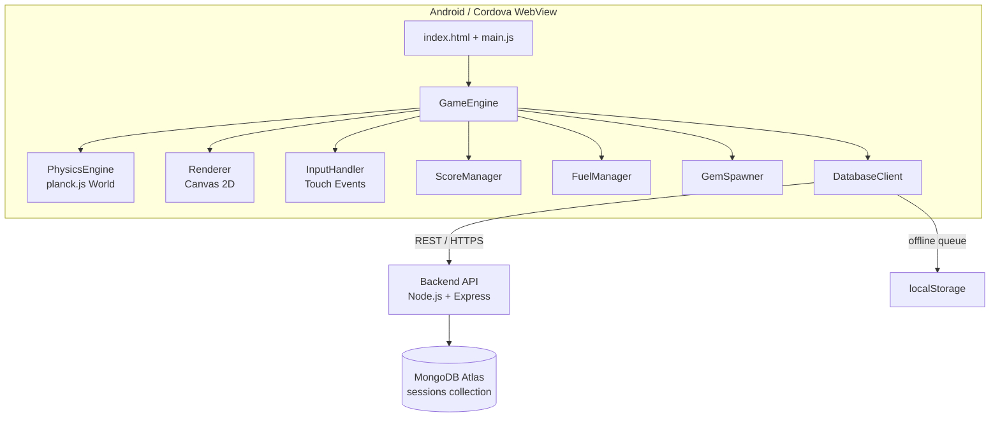
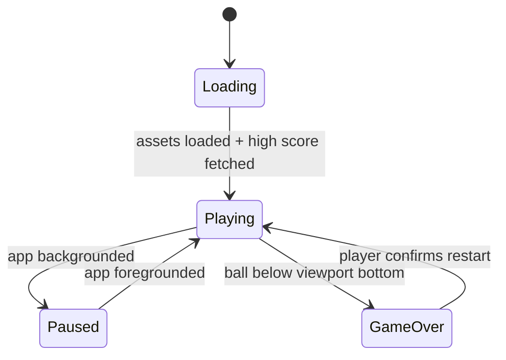

# Design Document: Ball Bounce Game

## Overview

Ball Bounce Game is a JavaScript-based Android mobile game packaged via Apache Cordova. A ball falls continuously under gravity; the player draws temporary platforms by dragging on the touchscreen to bounce the ball upward. The viewport scrolls upward as the ball rises, and the player collects gems to replenish the fuel needed to draw more platforms. The session ends when the ball falls below the bottom edge of the viewport.

**Key design decisions:**

- **Physics engine**: planck.js (a TypeScript/JavaScript port of Box2D) is chosen over a custom Canvas-based physics subsystem. It provides robust rigid-body dynamics, edge-shape collision detection, and a well-tested fixed-timestep simulation loop — all critical for predictable bounce behaviour.
- **Rendering**: HTML5 Canvas 2D API, driven by `requestAnimationFrame`. The physics world uses a separate coordinate space (metres) that is scaled to pixels for rendering.
- **Persistence**: A lightweight Node.js/Express backend (bundled with the Cordova app via a local server, or hosted remotely) exposes a REST API that the in-app `DatabaseClient` calls. The backend writes to MongoDB Atlas. When the device is offline, the client queues records in `localStorage` and retries on reconnection.
- **Android packaging**: Apache Cordova wraps the HTML/JS/CSS bundle in a WebView targeting Android API 26+.

---

## Architecture

The game follows a layered architecture with clear separation between the physics simulation, rendering, input handling, resource management, and persistence layers.



### Subsystem Responsibilities

| Subsystem | Responsibility |
|---|---|
| `GameEngine` | Owns the main game loop, session state machine, and coordinates all subsystems each frame |
| `PhysicsEngine` | Wraps planck.js; creates/destroys bodies, steps the simulation, fires collision callbacks |
| `Renderer` | Clears and redraws the Canvas each frame; applies the viewport offset transform |
| `InputHandler` | Listens for `touchstart`/`touchmove`/`touchend` events; emits `platformRequest` events |
| `ScoreManager` | Tracks height scrolled and gems collected; computes the session score |
| `FuelManager` | Tracks the fuel reserve; enforces the cap and the zero-fuel guard |
| `GemSpawner` | Spawns gems at randomised positions as height milestones are crossed |
| `DatabaseClient` | Persists session records to MongoDB via REST; queues writes when offline |

### Session State Machine



---

## Components and Interfaces

### GameEngine

```js
class GameEngine {
  constructor(config: GameConfig)

  // Lifecycle
  start(): void          // begins the rAF loop
  pause(): void          // suspends physics + rendering (app backgrounded)
  resume(): void         // resumes from paused state
  restart(): void        // resets all session state, starts new session

  // Per-frame hook (called by rAF loop)
  _tick(timestamp: DOMHighResTimeStamp): void

  // Event handlers wired up during construction
  _onPlatformRequest(start: Vec2, end: Vec2): void
  _onBallGemContact(gemId: string): void
  _onBallPlatformContact(platformId: string): void
  _onBallOutOfBounds(): void
}
```

`GameEngine._tick` implements the **fixed-timestep accumulator pattern**:

```
accumulator += min(deltaTime, MAX_DELTA)
while (accumulator >= FIXED_STEP) {
    physicsEngine.step(FIXED_STEP)
    accumulator -= FIXED_STEP
}
renderer.draw(accumulator / FIXED_STEP)   // interpolation alpha
```

`FIXED_STEP = 1/60 s`, `MAX_DELTA = 1/30 s` (caps at 2 sub-steps per frame to prevent spiral-of-death).

### PhysicsEngine

```js
class PhysicsEngine {
  constructor(gravity: number, config: PhysicsConfig)

  createBall(position: Vec2, radius: number): BodyHandle
  createPlatform(start: Vec2, end: Vec2, lifetime: number): PlatformHandle
  createGem(position: Vec2, radius: number): BodyHandle

  destroyBody(handle: BodyHandle): void
  step(dt: number): void

  // Collision callbacks (set by GameEngine)
  onBallPlatformContact: (platformId: string, relativeVelocity: number) => void
  onBallGemContact: (gemId: string) => void
  onBallOutOfBounds: (ballY: number) => void
}
```

Platforms are modelled as planck.js **edge shapes** attached to static bodies. The ball is a **circle shape** on a dynamic body with `restitution` set to the configured bounce coefficient. Gems are **sensor circle shapes** (no physical response, only contact events).

Velocity clamping is applied inside the `postSolve` contact listener:

```js
world.on('post-solve', (contact, impulse) => {
  const vel = ballBody.getLinearVelocity();
  const speed = vel.length();
  if (speed > MAX_BALL_SPEED) {
    ballBody.setLinearVelocity(vel.mul(MAX_BALL_SPEED / speed));
  }
});
```

### Renderer

```js
class Renderer {
  constructor(canvas: HTMLCanvasElement, config: RenderConfig)

  draw(alpha: number): void   // alpha = interpolation factor [0,1]

  // Called by GameEngine when viewport offset changes
  setViewportOffset(yOffset: number): void

  // Platform fade-out: opacity driven by remaining lifetime ratio
  setPlatformOpacity(platformId: string, lifetimeRatio: number): void
}
```

The renderer applies a single `ctx.translate(0, -viewportOffset)` transform before drawing world objects, then resets it for the HUD overlay. All world coordinates are in pixels (planck.js is configured with a pixels-per-metre scale so no separate unit conversion is needed in the renderer).

### InputHandler

```js
class InputHandler {
  constructor(canvas: HTMLCanvasElement, fuelManager: FuelManager)

  // Emits 'platformRequest' event with { start: Vec2, end: Vec2 }
  // Clamps platform length to [MIN_PLATFORM_PX, MAX_PLATFORM_PX]
  // Silently drops gesture if fuelManager.currentFuel === 0
  enable(): void
  disable(): void
}
```

Touch coordinates are translated from screen space to world space by adding the current viewport offset.

### ScoreManager

```js
class ScoreManager {
  readonly currentScore: number
  readonly currentHeight: number
  readonly gemsCollected: number
  readonly highScore: number

  setHighScore(score: number): void   // called at launch after DB fetch
  onHeightGained(pixels: number): void
  onGemCollected(): void
  computeFinalScore(): number         // height * HEIGHT_WEIGHT + gems * GEM_WEIGHT
  reset(): void
}
```

### FuelManager

```js
class FuelManager {
  readonly currentFuel: number        // [0, MAX_FUEL]
  readonly maxFuel: number

  deduct(amount: number): boolean     // returns false if insufficient fuel
  add(amount: number): void           // capped at maxFuel
  reset(): void                       // restores to STARTING_FUEL
}
```

### GemSpawner

```js
class GemSpawner {
  constructor(config: GemConfig, physicsEngine: PhysicsEngine)

  // Called by GameEngine each time height crosses a 200px milestone
  onHeightMilestone(heightPx: number): void

  // Returns 1–3 gem positions within the current viewport width
  _generateGemPositions(count: number, viewportWidth: number): Vec2[]
}
```

### DatabaseClient

```js
class DatabaseClient {
  constructor(config: DbConfig)

  // Called at launch; resolves with high score (or cached value if offline)
  fetchHighScore(): Promise<number>

  // Called at session end; queues locally if offline
  saveSession(record: SessionRecord): Promise<void>

  // Internal: drains the offline queue when connectivity is restored
  _flushQueue(): Promise<void>
}
```

`DatabaseClient` uses the browser `fetch` API to call the backend REST endpoints. Offline detection uses `navigator.onLine` plus `window` `online`/`offline` events. The queue is stored as a JSON array in `localStorage` under the key `bbg_pending_sessions`.

---

## Data Models

### GameConfig (runtime configuration)

```ts
interface GameConfig {
  gravity: number;              // pixels/s² (e.g. 980)
  maxBallSpeed: number;         // pixels/s (e.g. 1800)
  bounceRestitution: number;    // [0,1] (e.g. 0.85)
  platformLifetimeMs: number;   // milliseconds (e.g. 4000)
  platformFuelCost: number;     // fuel units per platform (e.g. 10)
  minPlatformPx: number;        // 50
  maxPlatformPx: number;        // 400
  startingFuel: number;         // (e.g. 100)
  maxFuel: number;              // (e.g. 200)
  gemFuelValue: number;         // fuel units per gem (e.g. 30)
  heightWeightScore: number;    // score multiplier for height
  gemWeightScore: number;       // score multiplier per gem
  targetFps: number;            // 60
  fixedStepS: number;           // 1/60
}
```

### SessionRecord (persisted to MongoDB)

```ts
interface SessionRecord {
  sessionId: string;        // UUID v4
  playerId: string;         // device-local UUID, stored in localStorage
  score: number;
  heightPx: number;
  gemsCollected: number;
  startedAt: string;        // ISO 8601
  endedAt: string;          // ISO 8601
  appVersion: string;
}
```

MongoDB collection: `sessions`  
Index: `{ playerId: 1, score: -1 }` for efficient high-score queries.

### PlatformHandle (in-memory)

```ts
interface PlatformHandle {
  id: string;
  body: planck.Body;
  createdAt: number;        // performance.now()
  lifetimeMs: number;
  startWorld: Vec2;
  endWorld: Vec2;
}
```

### GemHandle (in-memory)

```ts
interface GemHandle {
  id: string;
  body: planck.Body;
  position: Vec2;
  fuelValue: number;
}
```

### OfflineQueueEntry (localStorage)

```ts
interface OfflineQueueEntry {
  record: SessionRecord;
  enqueuedAt: string;       // ISO 8601
  retryCount: number;
}
```

---

## Correctness Properties

*A property is a characteristic or behavior that should hold true across all valid executions of a system — essentially, a formal statement about what the system should do. Properties serve as the bridge between human-readable specifications and machine-verifiable correctness guarantees.*

### Property 1: Gravity always acts downward

*For any* ball position and velocity at the start of a physics step, after calling `physicsEngine.step(FIXED_STEP)` the ball's vertical velocity component shall be more negative (or equal, if already at maximum downward speed) than before the step.

**Validates: Requirements 1.1, 1.4**

---

### Property 2: Bounce applies upward force proportional to incoming speed

*For any* ball approaching a horizontal platform with downward velocity `v_in`, after the collision the ball's vertical velocity shall be upward and its magnitude shall be within `[restitution * |v_in| * 0.9, restitution * |v_in| * 1.1]` (allowing for floating-point tolerance).

**Validates: Requirements 1.2**

---

### Property 3: Ball speed is always clamped

*For any* sequence of physics steps, the magnitude of the ball's velocity vector shall never exceed `MAX_BALL_SPEED`.

**Validates: Requirements 1.5**

---

### Property 4: Platform creation deducts fuel

*For any* fuel reserve `f > PLATFORM_FUEL_COST` and any valid platform gesture, after the platform is created the fuel reserve shall equal `f - PLATFORM_FUEL_COST`.

**Validates: Requirements 2.3**

---

### Property 5: Zero-fuel guard rejects platform creation

*For any* drag gesture when `currentFuel === 0`, the platform shall not be added to the simulation and the fuel reserve shall remain zero.

**Validates: Requirements 2.6**

---

### Property 6: Platform length clamping

*For any* drag gesture whose raw pixel length is outside `[MIN_PLATFORM_PX, MAX_PLATFORM_PX]`, the resulting platform's length shall equal the nearest boundary value (`MIN_PLATFORM_PX` or `MAX_PLATFORM_PX`).

**Validates: Requirements 2.7**

---

### Property 7: Gem collection increases fuel (capped at maximum)

*For any* fuel reserve `f ∈ [0, MAX_FUEL]` and gem with fuel value `g > 0`, after the ball contacts the gem the new fuel reserve shall equal `min(f + g, MAX_FUEL)`.

**Validates: Requirements 5.2, 5.3**

---

### Property 8: Gem spawn count is always within bounds

*For any* height milestone crossing, the number of gems spawned shall be in the range `[1, 3]` and all spawned gem positions shall lie within the current viewport's horizontal bounds.

**Validates: Requirements 5.1**

---

### Property 9: Score formula is correctly applied

*For any* height value `h ≥ 0` and gem count `n ≥ 0`, `ScoreManager.computeFinalScore()` shall return exactly `h * HEIGHT_WEIGHT + n * GEM_WEIGHT`.

**Validates: Requirements 7.1**

---

### Property 10: Score is monotonically non-decreasing during a session

*For any* sequence of height-gain and gem-collection events, the value returned by `ScoreManager.computeFinalScore()` shall never decrease between consecutive events.

**Validates: Requirements 3.3, 7.1**

---

### Property 11: Session record round-trip

*For any* `SessionRecord` object, serialising it to JSON and deserialising it shall produce an object with identical field values.

**Validates: Requirements 7.2**

---

### Property 12: Offline queue preserves all pending records

*For any* set of `SessionRecord` objects written to the offline queue while `navigator.onLine === false`, after `_flushQueue()` completes successfully the queue shall be empty and each record shall have been submitted exactly once.

**Validates: Requirements 7.5**

---

### Property 13: Viewport scrolls only upward

*For any* sequence of ball position updates, the viewport offset shall be monotonically non-decreasing (the viewport never scrolls downward).

**Validates: Requirements 3.4**

---

### Property 14: Platform fade opacity decreases with remaining lifetime

*For any* platform with remaining lifetime ratio `r ∈ [0, 0.2]`, the opacity used to render it shall be strictly less than the opacity used when `r > 0.2`.

**Validates: Requirements 8.4**

---

### Property 15: Collision detection fires for all overlapping bodies

*For any* ball position that geometrically overlaps an active platform or gem body, calling `physicsEngine.step(FIXED_STEP)` shall fire the corresponding contact callback (ball-platform or ball-gem) before the step returns.

**Validates: Requirements 6.2, 6.3**

---

## Error Handling

| Scenario | Handling Strategy |
|---|---|
| MongoDB connection unavailable at launch | `DatabaseClient.fetchHighScore()` catches the network error, reads `bbg_high_score` from `localStorage`, resolves with that value (or 0 if absent), and schedules a background retry with exponential back-off (1 s, 2 s, 4 s, max 30 s). |
| MongoDB write fails at session end | `saveSession()` catches the error, pushes the record onto the `bbg_pending_sessions` queue in `localStorage`, and resolves (does not reject) so the game-over screen is not blocked. |
| `_flushQueue()` partial failure | Each record is retried individually; successfully sent records are removed from the queue immediately. Failed records remain and are retried on the next `online` event. |
| Frame rate drops below 30 fps | The `MAX_DELTA` cap (1/30 s) limits the accumulator to at most 2 physics sub-steps per render frame, preventing the simulation from running ahead of real time. |
| Gesture produces a zero-length platform | `InputHandler` discards gestures where `start === end` before emitting `platformRequest`. |
| planck.js body creation fails | Wrapped in a try/catch; the error is logged and the platform/gem is silently skipped to avoid crashing the game loop. |
| App backgrounded mid-session | Cordova `pause` event triggers `GameEngine.pause()`, which cancels the `requestAnimationFrame` handle and records the pause timestamp. On `resume`, the accumulator is reset to 0 to prevent a large delta spike. |

---

## Testing Strategy

### Unit Tests (Jest)

Unit tests cover specific examples, edge cases, and pure-function logic:

- `FuelManager`: deduct/add/cap behaviour, zero-fuel guard
- `ScoreManager`: score formula, height accumulation, gem counting, reset
- `GemSpawner`: gem count distribution (1–3 per milestone), position bounds within viewport
- `InputHandler`: platform length clamping, coordinate translation, zero-fuel rejection
- `DatabaseClient`: offline queue serialisation/deserialisation, flush logic with mocked `fetch`
- `PhysicsEngine` (with planck.js): ball creation, platform creation/destruction, velocity clamping

### Property-Based Tests (fast-check)

Property-based testing is appropriate here because the game contains pure functions and invariants that must hold across a wide range of inputs (ball velocities, fuel values, platform geometries, session records). [fast-check](https://github.com/dubzzz/fast-check) is the chosen library for JavaScript/TypeScript.

Each property test runs a minimum of **100 iterations**.

Tag format: `// Feature: ball-bounce-game, Property N: <property text>`

| Property | Test description |
|---|---|
| P1 – Gravity always acts downward | Arbitrary ball state → step → vertical velocity more negative |
| P2 – Bounce proportional to incoming speed | Arbitrary downward velocity → collision → upward velocity within tolerance |
| P3 – Ball speed clamped | Arbitrary sequence of steps → speed ≤ MAX_BALL_SPEED always |
| P4 – Platform creation deducts fuel | Arbitrary fuel > PLATFORM_FUEL_COST → create platform → fuel reduced by cost |
| P5 – Zero-fuel guard | Fuel = 0 → any gesture → no platform created, fuel unchanged |
| P6 – Platform length clamping | Arbitrary gesture length → clamped to [MIN_PLATFORM_PX, MAX_PLATFORM_PX] |
| P7 – Gem collection capped | Arbitrary fuel + gem value → new fuel = min(f+g, MAX_FUEL) |
| P8 – Gem spawn count within bounds | Arbitrary height milestone → gem count in [1,3], positions within viewport |
| P9 – Score formula correctness | Arbitrary height + gem count → score = h*HEIGHT_WEIGHT + n*GEM_WEIGHT |
| P10 – Score non-decreasing | Arbitrary event sequence → score never decreases |
| P11 – Session record round-trip | Arbitrary SessionRecord → JSON round-trip → identical fields |
| P12 – Offline queue preserves records | Arbitrary set of records → flush → queue empty, each sent once |
| P13 – Viewport scrolls only upward | Arbitrary ball position sequence → viewport offset non-decreasing |
| P14 – Platform fade opacity | Arbitrary lifetime ratio ≤ 0.2 → opacity < full-lifetime opacity |
| P15 – Collision detection fires for all overlapping bodies | Arbitrary overlapping ball/platform or ball/gem → step → contact callback fires |

### Integration Tests

- `DatabaseClient` against a local MongoDB instance (Docker): verify `sessions` collection writes, high-score retrieval, and retry behaviour.
- Cordova build smoke test: verify the APK builds successfully and the WebView loads `index.html` without JavaScript errors.

### Manual / Device Tests

- Touch gesture responsiveness on a physical Android 8.0+ device
- Frame rate measurement under sustained gameplay (target ≥ 60 fps)
- App background/foreground cycle: verify physics pauses and resumes correctly
- Offline mode: disable network, play a session, re-enable network, verify score syncs
